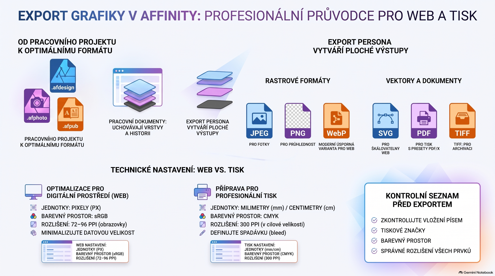

# Počítačová grafika – rastrová, vektorová grafika a favicon

Tento soubor obsahuje studijní podklad pro modul **Počítačová grafika**.

## Rastrová vs. vektorová grafika

Při práci s digitálními fotografiemi, grafickými návrhy, logy a dalšími digitálními obrázky se nejčastěji setkáte s rastrovými a vektorovými typy souborů.

### Co je rastrový soubor?

Rastrové soubory jsou obrázky sestavené z obrazových bodů (pixelů), malých barevných čtverečků, které ve velkém množství mohou tvořit velmi detailní obrázky, například fotografie. Čím více obrazových bodů obrázek má, tím vyšší je jeho kvalita, a naopak. Mezi běžné rastrové formáty patří JPEG, GIF a PNG.

### Co je vektorový soubor?

Vektorové soubory používají matematické rovnice, čáry a křivky s pevnými body v mřížce. Neobsahují obrazové body; matematické vzorce definují tvar, rámeček a barvu výplně. Proto lze vektorový obrázek zvětšovat nebo zmenšovat bez zhoršení kvality.

### Hlavní rozdíly

- **Rozlišení:** rastrová grafika je závislá na rozlišení (DPI/PPI), při velkém zvětšení mohou být viditelné pixely. Vektorová grafika se při změně velikosti nerozmaže.
- **Použití:** rastr je typický pro fotografie a detailní obrázky; vektor pro loga, ikony, digitální ilustrace a grafiku, která se má zobrazovat v různých velikostech.
- **Velikost souborů:** rastrové soubory mohou být větší, protože ukládají velké množství obrazových bodů. Lze je komprimovat pro web. Vektorové soubory bývají menší, protože ukládají matematický popis.
- **Kompatibilita:** rastry lze obvykle snadno otevřít v mnoha aplikacích a prohlížečích. Některé vektorové formáty vyžadují specializovaný software. Převod mezi rastrem a vektorem je možný, přičemž rastr na vektor bývá náročnější.

### Rastrové formáty

| Formát | Přípona |
|---|---|
| JPEG | .jpg |
| PNG | .png |
| GIF | .gif |
| BMP | .bmp |
| TIFF | .tiff |
| PSD | .psd |

### Vektorové formáty

| Formát | Přípona |
|---|---|
| SVG | .svg |
| EPS | .eps |
| AI | .ai |
| PS | .ps |
| EMF | .emf |

## Favicon

Favicon (favorite icon) je ikona stránky, která se zobrazuje například v panelech a záložkách prohlížeče, historii nebo ve vyhledávačích a pomáhá s rozpoznatelností webu. Je součástí brandingu a může přispět k orientaci uživatelů.

### SEO, UX a branding

Favicon podle podkladu přímo neurčuje pořadí ve vyhledávači, ale její zobrazení může podpořit viditelnost, zapamatovatelnost značky a nepřímo i míru prokliku (CTR).

### Vzhled a velikost

Favicon by měla být jednoduchá a dobře rozpoznatelná i při velmi malém zobrazení. Základní velikosti jsou 16×16 px a 32×32 px; pro mobilní zařízení a PWA jsou uvedeny také 192×192 px a 512×512 px.

Doporučované formáty zahrnují SVG pro škálovatelnost a PNG pro vyšší rozlišení a kompatibilitu; ICO je široce podporovaný formát. Pro dobrou čitelnost je vhodnější jednoduchý motiv než detailní obrázek.

### Tvorba favicony

Základní postup: vybrat logo/symbol, použít online generátor nebo grafický editor, vytvořit potřebné velikosti a formáty a otestovat výsledek v různých prohlížečích a na různých zařízeních.

Příklady online generátorů: favicon-generator.org, favicon.io, favicomatic.com a realfavicongenerator.net.

### WordPress

V administraci WordPressu se favicon nastavuje přes **Vzhled > Přizpůsobit → Identita webu → Ikona webu**, kde se nahraje PNG nebo ICO a změna se zveřejní pomocí **Publikovat**. U témat třetích stran se může nastavení lišit.

## Export grafiky pro web a tisk

Přiložené infografiky doplňují podklad o praktická doporučení pro export z grafického editoru.

- **Web:** pixely (px), sRGB, 72–96 PPI pro obrazovky a minimalizace datové velikosti.
- **Profesionální tisk:** mm/cm, CMYK, 300 PPI v cílové velikosti a definovaná spadávka (bleed).
- **Výstupní formáty:** JPEG pro fotografie, PNG pro průhlednost, WebP pro úsporu místa na webu, SVG pro škálovatelnou webovou grafiku, PDF pro tisk a TIFF pro archivaci.
- **Pracovní dokument vs. export:** pracovní dokument zachovává vrstvy a historii; exportní proces vytváří ploché výstupy pro cílové použití.
- **Kontrola před exportem:** vložení písem, tiskové značky, barevný prostor a správné rozlišení všech prvků.

## Přiložené ilustrace

